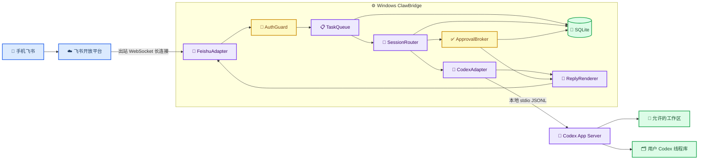
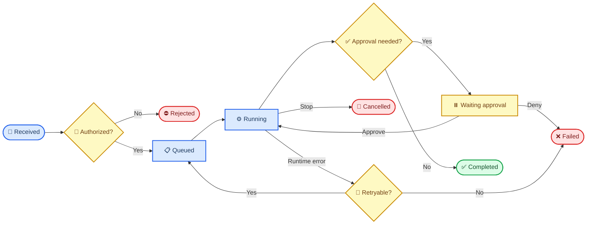
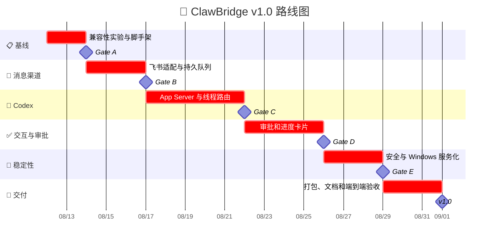

# ClawBridge 制作计划

_面向单一可信用户的手机消息渠道到 Windows 本机 Codex 的安全控制桥，计划基线日期：2026-08-11。_

---

## 📋 执行摘要

ClawBridge 的目标是让用户在手机不连接 OpenAI、也不访问电脑公网端口的情况下，通过飞书向 Windows 电脑上的 Codex 下发任务、查看进度、处理审批并接收结果。电脑仍需能够访问飞书和 Codex/OpenAI；电脑关机或休眠时，本地版不能执行任务。

推荐采用“两步交付”路线：

1. 用 OpenClaw 的飞书与原生 Codex 插件完成兼容性基线，快速确认账号、消息、线程共享和审批链路可行
2. 在本仓库实现独立的轻量 Bridge，直接对接飞书长连接与 Codex App Server，不 fork OpenClaw 核心

独立 Bridge 选择 TypeScript、Node.js、SQLite 和 Windows 原生启动脚本。飞书是首发渠道，微信私聊适配排在 v1 之后。

### 交付目标

| 版本      | 结果                                          | 预计完成时间 |
| --------- | --------------------------------------------- | -----------: |
| v0.1 POC  | 飞书消息可触发本机 Codex 并返回最终结果       |      第 1 周 |
| v0.2 MVP  | 支持项目选择、线程续接、队列、停止和重启恢复  |      第 2 周 |
| v0.3 Beta | 支持审批、进度卡片、安全策略和 Windows 服务化 |      第 3 周 |
| v1.0      | 完成安装、升级、诊断、端到端验收和文档        |      第 4 周 |

> 📌 **估算边界：** 时间按一名开发者全职投入估算。飞书或 Codex 账号权限、企业应用审核和网络问题不计入纯开发时间。

## 🎯 产品范围

### MVP 必须具备

- 飞书机器人单聊接收文本命令
- 只允许一个已登记的用户控制 Bridge
- 预登记多个本地工作区，但不能访问任意系统路径
- 新建、绑定、查看和续接 Codex 线程
- 持续回传任务状态、最终摘要、修改文件和测试结论
- 支持停止任务和向运行中的任务追加引导
- 接收并处理命令执行、文件修改和网络访问审批
- 消息去重、任务持久化、Bridge 重启恢复
- Windows 登录后自动启动、异常退出自动重启
- 日志脱敏、健康检查和一键诊断包

### MVP 明确不做

- 不通过键鼠、OCR 或桌面 UI 自动化控制 Codex
- 不开放 Codex App Server WebSocket 或电脑公网端口
- 不允许陌生用户、开放群聊或多租户共享
- 不默认授予全磁盘、管理员或无审批执行权限
- 不自动执行 `git push`、发布、删除仓库或系统配置修改
- 不在首版实现语音、图片理解、定时任务和手机文件浏览器
- 不保证电脑关机或休眠期间立即执行；云端离线邮箱属于后续增强

### 首发使用场景

1. 用户发送“检查某项目当前改动，只审计不修改”
2. Bridge 选择工作区并启动只读 Codex 线程
3. 用户继续发送“修复刚才的问题并运行测试”
4. Bridge 将同一会话续接到原 Codex 线程
5. 高风险操作通过飞书卡片或 `/approve` 命令确认
6. Bridge 返回修改文件、测试结果、未验证事项和线程 ID

## 🏗️ 技术架构

飞书官方长连接由本地进程主动建立 WebSocket，不要求公网 IP、域名或内网穿透；事件处理必须快速完成，因此接收器只做校验、落库和入队，实际 Codex 工作由异步 Worker 执行。[^1]

Codex App Server 使用本机 `stdio` JSONL 传输。它支持线程启动/续接、事件流和审批请求；Bridge 不启用实验性的远程 WebSocket 监听。[^2]



### 核心技术决策

| 决策       | 选择                              | 理由                                                  |
| ---------- | --------------------------------- | ----------------------------------------------------- |
| 运行时     | Node.js + TypeScript              | 飞书有官方 Node SDK；事件、队列和子进程流处理适配自然 |
| 消息入口   | 飞书企业自建机器人长连接          | 手机国内可用，不需要电脑公网入口                      |
| Codex 接口 | App Server `stdio`                | 支持完整事件和审批，避免暴露网络监听                  |
| 状态存储   | SQLite WAL                        | 单机、可恢复、无需额外数据库服务                      |
| 线程共享   | 用户 Codex home                   | 允许发现桌面端/CLI 的持久线程，但写入需租约保护       |
| 服务管理   | PowerShell + Windows 任务计划程序 | 可检查、可停止、可恢复，不依赖 GUI 登录操作           |
| 微信扩展   | 独立 `ChannelAdapter`             | 避免微信登录或协议变化影响飞书主链路                  |

OpenAI 官方 Codex SDK 和 App Server支持程序化启动、继续和恢复本机 Codex 线程。[^3] OpenClaw 当前也通过原生 Codex Harness 验证了“消息渠道负责路由、Codex 负责本机线程与执行”的组合，并支持选择用户 Codex home 与桌面端/CLI共享线程。[^4]

### 模块边界

| 模块                | 职责                                   | 禁止承担的职责                 |
| ------------------- | -------------------------------------- | ------------------------------ |
| `ChannelAdapter`    | 收发、解析、幂等键和消息能力声明       | 不执行 Codex 或访问工作区      |
| `AuthGuard`         | 用户、群聊、项目和命令授权             | 不通过提示词替代硬授权         |
| `TaskQueue`         | 落库、排队、重试和恢复                 | 不保存明文密钥                 |
| `SessionRouter`     | 会话到项目、Codex 线程和租约映射       | 不允许两个客户端并发写同一线程 |
| `CodexAdapter`      | App Server 生命周期、JSONL、事件和取消 | 不开放非本地监听地址           |
| `ApprovalBroker`    | 审批生成、超时、决定和审计             | 不自动批准危险或破坏性操作     |
| `ReplyRenderer`     | 飞书卡片、节流、分片和最终摘要         | 不回传密钥或无限长度日志       |
| `WindowsSupervisor` | 启停、健康检查、重启和日志轮转         | 不修改系统全局代理或安全软件   |

### 建议目录结构

```text
claw/
├── src/
│   ├── app.ts
│   ├── channels/
│   │   ├── channel-adapter.ts
│   │   ├── feishu-adapter.ts
│   │   └── wechat-adapter.ts        # v1 后启用
│   ├── codex/
│   │   ├── app-server-client.ts
│   │   ├── protocol-types.ts
│   │   └── event-normalizer.ts
│   ├── core/
│   │   ├── task-worker.ts
│   │   ├── session-router.ts
│   │   ├── session-lease.ts
│   │   ├── approval-broker.ts
│   │   └── command-router.ts
│   ├── persistence/
│   │   ├── database.ts
│   │   ├── migrations/
│   │   └── repositories/
│   ├── security/
│   │   ├── authorization.ts
│   │   ├── path-policy.ts
│   │   └── redaction.ts
│   ├── delivery/
│   │   ├── reply-renderer.ts
│   │   └── progress-throttler.ts
│   └── ops/
│       ├── health.ts
│       └── diagnostics.ts
├── scripts/
│   ├── install.ps1
│   ├── start.ps1
│   ├── stop.ps1
│   ├── status.ps1
│   └── doctor.ps1
├── tests/
│   ├── unit/
│   ├── integration/
│   ├── contract/
│   └── e2e/
├── config/
│   ├── default.example.yaml
│   └── projects.example.yaml
└── docs/
    ├── SECURITY.md
    ├── OPERATIONS.md
    └── PROTOCOL.md
```

## 🔄 任务与线程模型

### 数据实体

| 实体            | 关键字段                                 | 说明                      |
| --------------- | ---------------------------------------- | ------------------------- |
| `channel_users` | `channel`, `sender_id`, `role`           | 控制者白名单              |
| `projects`      | `project_id`, `root_path`, `enabled`     | 规范化后的允许工作区      |
| `conversations` | `chat_id`, `project_id`, `thread_id`     | 飞书会话与 Codex 线程映射 |
| `tasks`         | `task_id`, `event_id`, `state`, `prompt` | 可恢复任务队列            |
| `approvals`     | `approval_id`, `task_id`, `decision`     | 审批审计记录              |
| `thread_leases` | `thread_id`, `holder`, `expires_at`      | 防止桌面与 Bridge 并发写  |
| `deliveries`    | `task_id`, `message_id`, `status`        | 消息发送与重试状态        |

### 任务状态机



### 并发规则

- 同一个 `thread_id` 同时只允许一个写入持有者
- Bridge 发现桌面端任务可能仍在运行时，默认拒绝续写并提示 fork
- 不同项目或不同线程可以并行，但 MVP 全局并发数先限制为 `1`
- 子代理任务由 Codex 自己管理，Bridge 只追踪根线程和可见事件
- 重启后将 `running` 任务标记为 `interrupted`，重新连接线程后由用户选择恢复或终止

## 💬 手机命令设计

自然语言消息默认发送给当前绑定的 Codex 线程。以 `/` 开头的消息由 Bridge 自己处理，不进入模型。

| 命令             | 行为                              |  MVP |
| ---------------- | --------------------------------- | ---: |
| `/help`          | 显示命令和当前权限                |   是 |
| `/health`        | 检查 Bridge、飞书、数据库和 Codex |   是 |
| `/projects`      | 列出允许的项目                    |   是 |
| `/use <project>` | 切换当前项目                      |   是 |
| `/new`           | 为当前项目新建 Codex 线程         |   是 |
| `/threads`       | 列出最近的可用线程                |   是 |
| `/resume <id>`   | 续接空闲线程                      |   是 |
| `/status`        | 显示当前任务、计划和耗时          |   是 |
| `/stop`          | 请求中止当前任务                  |   是 |
| `/steer <text>`  | 向运行任务追加方向                | Beta |
| `/approve <id>`  | 单次批准待处理请求                | Beta |
| `/deny <id>`     | 拒绝待处理请求                    | Beta |
| `/review`        | 请求 Codex 审查当前 diff          | Beta |
| `/diagnostics`   | 生成脱敏诊断包                    | v1.0 |

禁止实现 `/shell <raw command>`。系统操作必须通过 Codex 的受控执行和审批路径完成。

## 🔐 安全设计

### 硬性安全边界

1. 首版只允许一个飞书 `open_id`，`groupPolicy` 等价行为固定为关闭
2. 每个项目根目录在配置时解析为绝对规范路径；请求路径必须落在根目录内
3. Codex 默认 `workspace-write` 和按需审批，不允许 `danger-full-access`
4. App Server 只通过子进程 `stdio` 通信，不绑定 TCP 端口
5. 密钥使用 Windows DPAPI 或 Credential Manager 保存，不写入仓库和普通日志
6. 所有外发文本经过 Token、Cookie、Authorization 头和常见密钥格式脱敏
7. 删除、工作区外写入、持久环境修改、软件安装和远程发布始终需要人工批准
8. 项目目录中的文本、附件和工具结果均视为不可信输入，授权不能依赖模型判断

OpenClaw 的安全指南同样将消息驱动的高权限代理限定为单可信操作者，并建议先做身份限制、作用域限制和沙箱，再考虑模型防护。[^5]

### 审批策略

| 风险级别 | 示例                                       | 默认处理             |
| -------- | ------------------------------------------ | -------------------- |
| 低       | 读取文件、`git status`、查看测试配置       | 自动允许             |
| 中       | 工作区内修改、运行已知测试命令             | Codex/策略审查后允许 |
| 高       | 下载、安装、访问新域名、长时间命令         | 飞书人工批准一次     |
| 禁止     | 管理员提权、关闭安全软件、工作区外递归删除 | Bridge 直接拒绝      |

审批消息至少展示任务、项目、命令或文件范围、理由、有效期以及“批准一次/拒绝”选项。MVP 不提供“永久批准”。

## 🧪 开发阶段与验收闸门

### Phase 0：兼容性基线与脚手架

**工期：** 2 个工作日

任务：

- 初始化 Git、TypeScript、测试、格式化和日志框架
- 用 OpenClaw 飞书插件和 Codex Harness完成一次真实链路实验
- 确认本机 Codex home、认证方式、线程列表和工作区路径
- 固定飞书、Codex 与 Node 依赖版本并记录兼容矩阵
- 定义配置 schema、事件 schema 和错误分类

验收 Gate A：

- [ ] 手机飞书无需代理即可向机器人发送消息
- [ ] 电脑收到消息并能返回固定回复
- [ ] 本机 Codex 可以创建一个测试线程并返回结果
- [ ] 已记录线程是否能在 Codex Desktop 中发现
- [ ] 未开始修改真实项目

### Phase 1：飞书渠道与持久队列

**工期：** 3 个工作日

任务：

- 实现 `ChannelAdapter` 和 `FeishuAdapter`
- 接收 `im.message.receive_v1`，按 `event_id` 去重
- 处理函数完成校验和落库后立即返回，Worker 异步执行
- 实现文本回复、错误回复、消息分片和发送重试
- 建立 SQLite migration、任务队列和 delivery 记录

验收 Gate B：

- [ ] 同一事件重复投递不会产生第二个任务
- [ ] 未授权用户无法触发 Worker
- [ ] Bridge 重启后排队任务仍存在
- [ ] 超长回复不会因单条消息限制丢失
- [ ] 飞书断线后可以自动重连

### Phase 2：Codex App Server 与线程路由

**工期：** 5 个工作日

任务：

- 实现 App Server 子进程启动、握手、JSONL 编解码和退出清理
- 生成或固定当前 App Server 协议类型，增加契约测试
- 实现 `thread/start`、`thread/resume`、`turn/start` 和中止
- 映射飞书会话、项目和 Codex 线程
- 实现线程租约和并发保护
- 归一化计划、命令输出、文件变化、错误和最终回复事件

验收 Gate C：

- [ ] `/new` 能在选定项目创建线程
- [ ] 后续消息继续同一个线程上下文
- [ ] `/resume` 只能续接存在且空闲的线程
- [ ] `/stop` 能让活动任务进入明确终态
- [ ] App Server 异常退出不会让 Bridge 一同崩溃
- [ ] 同一线程的并发写入被阻止或安全 fork

### Phase 3：审批和手机交互

**工期：** 4 个工作日

任务：

- 实现 `ApprovalBroker` 和审批超时
- 将 App Server 命令、文件和权限请求映射为飞书卡片
- 实现 `/approve`、`/deny` 和重复决定幂等
- 增加节流后的计划、进度和测试状态更新
- 实现最终结果模板：结论、改动、验证、未验证、线程 ID

验收 Gate D：

- [ ] 未批准的高风险操作不能执行
- [ ] 过期审批不能被旧按钮重新激活
- [ ] 非任务所有者不能批准
- [ ] 批准一次不会变成永久授权
- [ ] 手机能区分执行中、等待审批、失败、取消和完成

### Phase 4：安全、恢复与 Windows 运行

**工期：** 3 个工作日

任务：

- 实现用户、项目、路径、操作和出站内容策略
- 使用 DPAPI/Credential Manager 管理秘密
- 实现 `install/start/stop/status/doctor.ps1`
- 配置登录启动、失败重启、日志轮转和健康检查
- 执行重启、断网、休眠恢复和磁盘写满故障演练

验收 Gate E：

- [ ] `doctor.ps1` 能明确区分飞书、数据库、Codex 和网络故障
- [ ] 普通日志和诊断包不包含密钥
- [ ] Windows 重启后服务自动恢复
- [ ] 没有非本地监听端口
- [ ] 工作区逃逸测试全部被拒绝
- [ ] 连续运行 8 小时无未处理异常或任务丢失

### Phase 5：v1.0 打包与交付

**工期：** 3 个工作日

任务：

- 制作版本锁定、升级、回滚和卸载流程
- 编写 `README.md`、`SECURITY.md`、`OPERATIONS.md` 和故障排查
- 运行完整单元、契约、集成和端到端测试
- 在干净 Windows 用户环境进行一次安装验收
- 保存脱敏测试记录和已知限制

验收 Gate F：

- [ ] 新环境能按文档完成安装和首次绑定
- [ ] 所有必须测试通过，未运行测试明确标注
- [ ] 升级失败可以回滚到上一版本
- [ ] 可以完整停止服务并保留或选择删除本地状态
- [ ] v1.0 不依赖开发机上的全局源码路径

## 📅 四周排期



## 🧪 测试计划

### 单元测试

- 用户和命令授权矩阵
- Windows 路径规范化、大小写、连接点和目录逃逸
- 飞书事件去重和消息分片
- 任务状态机与重试次数
- 线程租约竞争和过期回收
- 审批超时、重复决定和越权决定
- 日志和外发内容脱敏

### 契约测试

- 飞书事件 payload 与响应格式
- Codex App Server 握手和核心 JSONL 消息
- 命令、文件、审批和错误事件归一化
- 升级前后 SQLite migration

### 集成测试

- 模拟飞书 + 真实 SQLite
- 真实飞书测试机器人 + 假 Codex App Server
- 假飞书 + 真实 Codex 测试工作区
- Codex 退出、超时、断流和重新启动

### 端到端测试

| 场景        | 输入                   | 必须观察到的结果               |
| ----------- | ---------------------- | ------------------------------ |
| 只读审计    | 请求检查测试仓库       | 没有文件变化，返回证据和结论   |
| 工作区修改  | 请求修改一个测试文件   | 只修改允许目录，返回 diff 摘要 |
| 高风险命令  | 请求安装或联网         | 手机收到审批，未批准前不执行   |
| 中途停止    | 长时间测试期间 `/stop` | Codex 停止，任务进入取消状态   |
| Bridge 重启 | 任务排队后重启         | 队列恢复，不重复执行           |
| 并发冲突    | 桌面和手机选择同一线程 | Bridge 拒绝并建议 fork         |
| 敏感输出    | 工具输出包含假 Token   | 手机和日志中均被遮盖           |

## ⚠️ 风险登记

| 风险                      | 影响                  | 应对措施                                      |
| ------------------------- | --------------------- | --------------------------------------------- |
| Codex App Server 协议升级 | Bridge 无法解析新事件 | 锁定版本、生成 schema、契约测试、显式兼容矩阵 |
| 桌面与 Bridge 同时写线程  | 线程状态冲突          | 本地租约、活动检测、默认 fork                 |
| 飞书事件重投              | 任务重复执行          | `event_id` 唯一约束和任务幂等键               |
| 电脑休眠或关机            | 无法即时接单          | 自动启动、禁用任务期间休眠；后续增加云端邮箱  |
| Codex 输出过长            | 消息刷屏或发送失败    | 进度节流、摘要、分片、文件附件                |
| 项目内容提示注入          | 越权执行              | 硬授权、工作区限制、审批和禁止策略            |
| 密钥进入日志              | 账号泄漏              | 系统凭据存储、结构化脱敏、诊断包扫描          |
| 微信协议或插件变化        | 第二渠道失效          | 与飞书解耦，固定插件版本，微信不阻塞 v1       |

## 🚀 v1 之后的路线

### 微信私聊适配

OpenClaw 的微信渠道当前通过腾讯微信团队维护的外部插件接入，支持私聊和媒体，但未声明群聊能力。独立 Bridge 应把它作为可替换的 `ChannelAdapter`，先验证登录生命周期、凭据刷新和消息协议，再决定直接集成还是通过受控 sidecar 复用。[^6]

### 云端离线邮箱

当需要电脑关机期间继续接收任务时，可增加一个国内轻量中继：

- 云端只保存加密任务信封和状态，不持有电脑文件访问能力
- Windows Agent 主动建立出站连接或轮询，不开放电脑入站端口
- 电脑上线后领取任务，执行结果再通过飞书发送
- 中继与本地 Bridge 使用设备密钥、重放保护和任务签名

该模块不应进入 MVP，因为它会引入部署、费用、密钥轮换和数据合规边界。

### 多电脑支持

- 每台电脑使用独立设备 ID 和密钥
- 项目配置绑定到设备，不允许客户端任意指定机器路径
- 手机通过 `/devices` 和 `/use <device>/<project>` 选择目标
- 一个 Codex 线程只属于一个设备，不跨机器续写本地线程

## ✅ 开工定义

满足以下条件后进入 Phase 0：

- [ ] 已创建飞书企业自建应用并启用机器人能力
- [ ] 已取得 App ID 和 App Secret，但不通过聊天或 Git 传递
- [ ] 已确认电脑上的 Codex Desktop/CLI 当前能正常执行本机任务
- [ ] 已指定一个无敏感数据的测试仓库
- [ ] 已确认首版只允许一个用户和飞书单聊
- [ ] 已确认是否要求共享现有 Codex Desktop 线程
- [ ] 已接受电脑关机或休眠时本地版无法执行任务的限制

第一条代码任务应当是“创建项目脚手架、配置 schema 和假 Feishu/App Server 契约测试”，而不是直接连接真实项目执行写操作。

## 🔗 参考资料

[^1]: 飞书开放平台. (2026). “使用长连接接收事件.” https://open.feishu.cn/document/server-docs/event-subscription-guide/event-subscription-configure-/request-url-configuration-case?lang=zh-CN

[^2]: OpenAI. (2026). “Codex App Server.” https://learn.chatgpt.com/docs/app-server

[^3]: OpenAI. (2026). “Codex SDK.” https://learn.chatgpt.com/docs/codex-sdk

[^4]: OpenClaw Foundation. (2026). “Codex harness.” https://docs.openclaw.ai/plugins/codex-harness

[^5]: OpenClaw Foundation. (2026). “Security.” https://docs.openclaw.ai/gateway/security

[^6]: OpenClaw Foundation. (2026). “WeChat.” https://docs.openclaw.ai/channels/wechat

---

_计划维护规则：每个 Gate 通过后更新实际耗时、验证证据、未完成项和下一阶段风险。_
